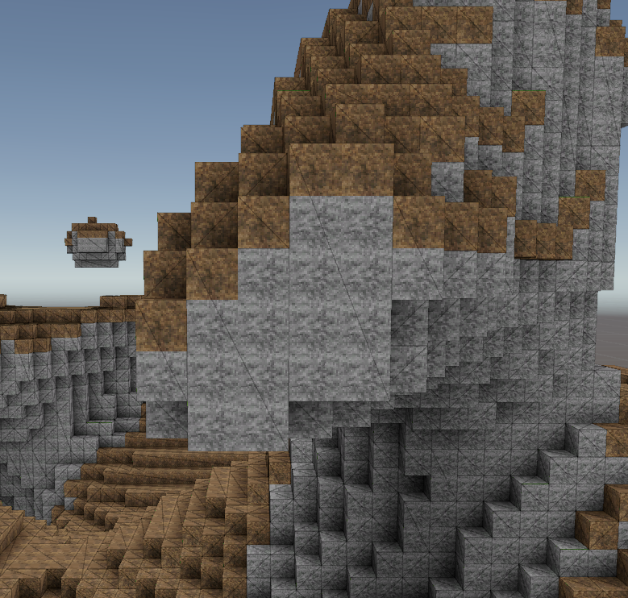
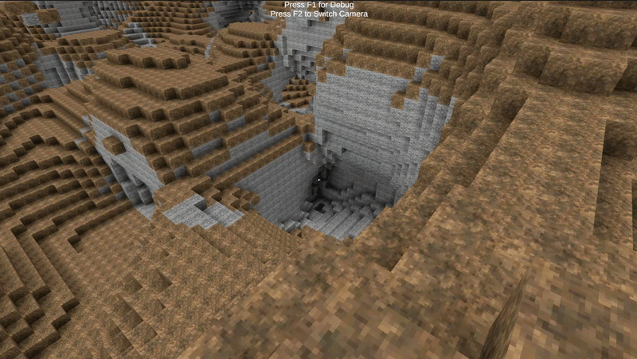
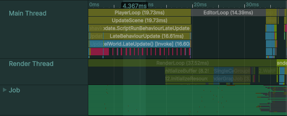
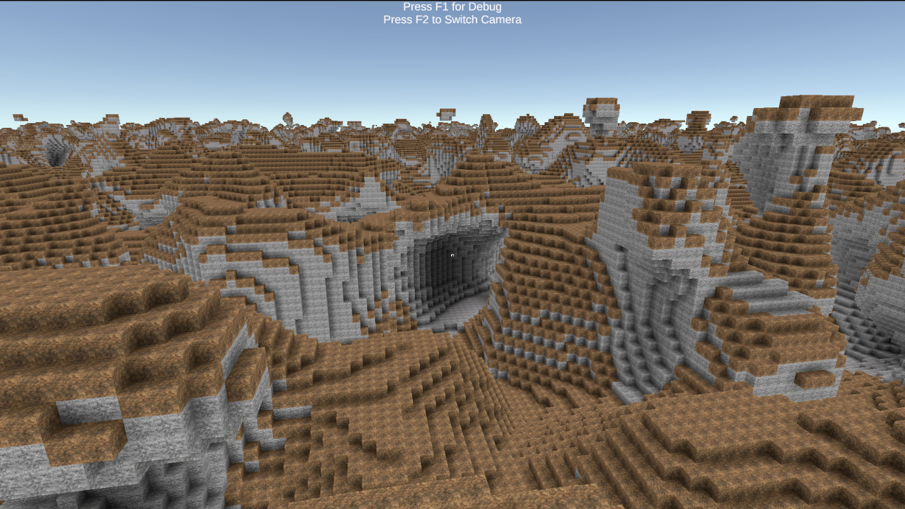

# Unity Voxel Engine

<div align="center">


**A high-performance voxel engine for Unity built on the Job System and Burst Compiler.**

Binary face culling · Greedy meshing · Ambient occlusion · Flood-fill sun lighting · Fully parallel


</div>

> This project was inspired by [this fantastic breakdown of greedy meshing](https://www.youtube.com/watch?v=4xs66m1Of4A). Highly recommended watch before diving into the code.
>
> I'm writing a detailed blog series on how every system here was built. Follow along at **[shipthecode.dev](https://shipthecode.dev)**.


## Features

- **Binary face culling** uses 64-bit bitmask operations to reduce visible face detection to a handful of bitwise instructions per slice
- **Greedy meshing** merges adjacent coplanar faces into the largest possible quads, drastically cutting vertex and triangle counts
- **Custom shader** encodes voxel ID and light level per-vertex instead of per-face, which allows the greedy merge step to be more aggressive than a naive implementation
- **Ambient occlusion** is baked directly into the mesh at generation time with zero runtime cost
- **Flood-fill sun lighting** propagates 4-bit (0-15) light values using a queue-based flood fill running as a Burst-compiled job
- **Live voxel editing** — add or remove voxels at runtime and the lighting and mesh update automatically
- **Jobs + Burst throughout** — voxel generation, bit matrix building, lighting, and meshing all run as Burst-compiled `IJob` structs on worker threads
- **Spiral chunk loading** queues chunks outward from the player so the area around the player is always prioritised
- **Perlin noise terrain** included out of the box, easy to replace by implementing a single interface


## How It Works

### Chunk Pipeline

Each 64×64×64 chunk goes through a structured async pipeline before it appears on screen:

```
Voxel Generation (IVoxelsGenerator)
        │
        ▼  [parallel]
┌───────────────────┐   ┌──────────────────┐   ┌────────────────────┐
│  VoxelBuffer job  │   │  BitMatrix job   │   │  Local Sun Light   │
│  (pack voxel IDs  │   │  (3×64 ulongs,   │   │  (flood fill from  │
│   into uint[])    │   │   face culling)  │   │   top of chunk)    │
└───────────────────┘   └──────────────────┘   └────────────────────┘
        │                       │                        │
        └───────────────────────┴────────────────────────┘
                                │
                                ▼
                  Neighbor Light Seeding
                  (copy border values from
                   already-loaded neighbors)
                                │
                                ▼
                  Neighbor Flood Fill job
                                │
                                ▼
                      Mesh Generation job
                      (binary cull → greedy
                       merge → AO → encode)
                                │
                                ▼
                     ChunkGameObject updated
```

### Binary Face Culling

Three 64×64 bitmasks (one per axis) represent which voxel slots are solid. A single bitwise shift and AND produces the set of faces that need to be drawn, with no per-voxel comparisons.

```
visible_faces = solid_mask & ~(solid_mask >> 1)
```

### Greedy Meshing



After culling, the algorithm scans each 2D slice of the chunk and merges adjacent visible faces into the largest rectangles possible. The custom shader encodes the voxel ID per-vertex, so faces of different block types can be merged into a single quad. Faces with different lighting or AO values still can't be merged.

### Ambient Occlusion



AO is computed at mesh generation time. For each vertex, the four surrounding corner voxels are sampled and the occlusion value is packed directly into the vertex data. The shader applies a cosine curve for a soft look:

```glsl
ao = 1.0 - cos((light / 15.0 * PI) / 2.0)
finalColor *= lerp(1.0, ao, _AOStrength);
```

No screen-space passes, no ray marching.

### Flood-Fill Sun Lighting


Light values are 4-bit integers (0-15). Sun light enters from the top of each chunk and propagates downward and outward using a queue-based flood fill. When a voxel is added or removed, only the affected region is recalculated. Darkness propagates first, then light re-floods from surviving sources.


## Performance



Every expensive step runs as a Burst-compiled job on Unity's worker threads. Multiple chunks generate simultaneously, and the phases within each chunk (voxel buffer, bit matrix, lighting) run in parallel via combined `JobHandle` dependencies.


## Getting Started

### Requirements

- Unity **6000.0** or later
- Universal Render Pipeline (URP)
- Packages: `com.unity.entities`, `com.unity.inputsystem` (pulled in automatically)

### Installation

Add the package via the Unity Package Manager using the **git URL**:

```
https://github.com/Seremonik/VoxelEngine.git
```

Or clone the repository and add it as a local package:

1. Clone this repo anywhere on disk
2. In Unity: **Window → Package Manager → + → Add package from disk**
3. Select `package.json` from the cloned folder

### Setup

1. Create a new URP project (or use an existing one)
2. Add a `VoxelWorld` component to a GameObject in your scene
3. Assign an `EngineSettings` ScriptableObject (**Assets → Create → VoxelEngine → Engine Settings**)
4. Implement `IVoxelsGenerator` to define your terrain, or use the included `HillsVoxelsGenerator`
5. Call `voxelWorld.SetPlayerChunk(playerChunkPosition)` each frame to drive chunk loading

`EngineSettings` exposes three properties:

| Property | Description |
|----------|-------------|
| `AO Strength` | Controls how strong the ambient occlusion effect appears (0 = off, 1 = full) |
| `World Radius` | How many chunks to load around the player |
| `Max Jobs Per Frame` | Limits how many chunk generation jobs are scheduled each frame |


## Sample Scene



The included sample (`Samples/Basic Example`) gives you a fully playable scene out of the box.

**Controls:**

| Key | Action |
|-----|--------|
| `WASD` | Move |
| `Mouse` | Look |
| `Space` | Jump |
| `Left Click` | Remove voxel |
| `Right Click` | Place voxel |
| `B` | Lock / unlock cursor |
| `C` | Freeze movement |
| `F1` | Toggle debug view |
| `F2` | Toggle first / third person camera |

Import it via **Package Manager → VoxelEngine → Samples → Basic Example → Import**.


## Writing a Custom Voxel Generator

Implement `IVoxelsGenerator` and schedule a Burst-compiled job that fills the `ChunkData.Voxels` array:

```csharp
public class MyGenerator : VoxelsGeneratorBase
{
    public override JobHandle GenerateVoxels(ChunkData chunkData, int3 chunkPosition, JobHandle dependency)
    {
        var job = new MyGenerationJob
        {
            Voxels = chunkData.Voxels,
            ChunkPosition = chunkPosition
        };
        return job.Schedule(dependency);
    }
}
```

Voxel values: `0` = air, `1`+ = block ID (up to 255 block types). The engine handles culling, lighting, and meshing.


## Known Issues

- **Chunk-edge lighting** — light values can be incorrect at the seam between two chunks. Top priority fix, coming in an upcoming update.


## Roadmap

- [ ] Fix chunk-edge lighting seams
- [ ] Level of Detail (LOD)
- [ ] Serialization
- [ ] Dynamic lighting
- [ ] Complex world generation (biomes, caves, structures)

Follow development on the blog: **[shipthecode.dev](https://shipthecode.dev)**


## Blog Series

I'm writing a detailed breakdown of how this engine was built — the math, the Job System patterns, the shader tricks, all of it. If you want to understand not just what the code does but why, start there.

**[shipthecode.dev](https://shipthecode.dev)**


## License

MIT — see [LICENSE](LICENSE) for details.
